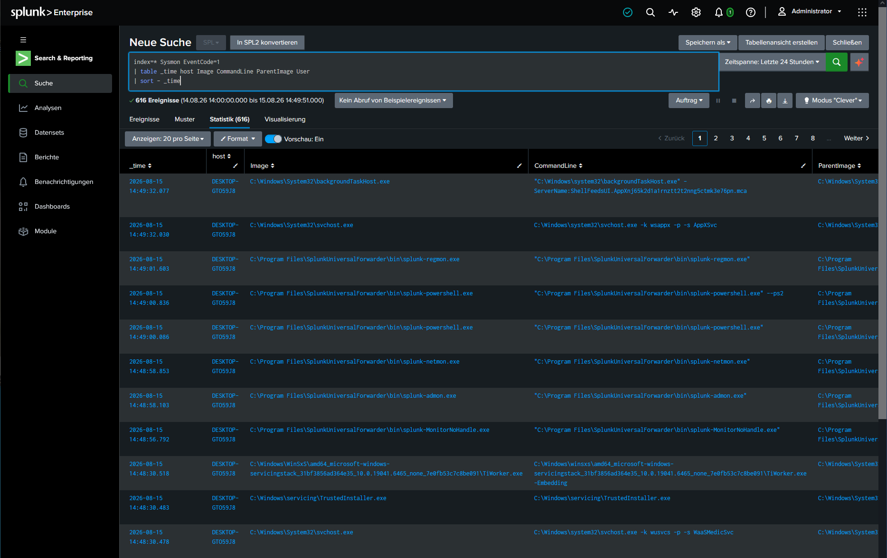
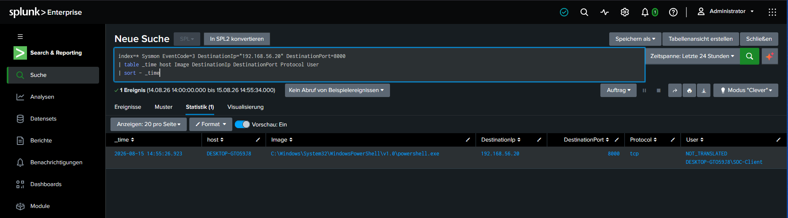
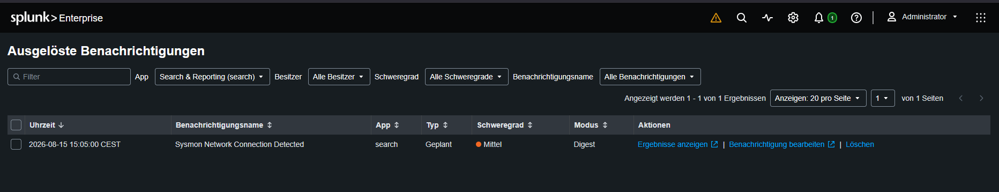

# Detection: Sysmon Network Connection Monitoring

## Overview

This use case demonstrates the integration of Microsoft Sysmon with Splunk Enterprise and the detection of outbound process network connections using Sysmon Event ID `3`.

Sysmon provides additional endpoint telemetry beyond the default Windows Security logs, including detailed process creation and network connection events.

The lab uses this telemetry to identify a process establishing a connection to the SOC server on TCP port `8000`.

---

## Data Source

- **Endpoint:** Windows 10 SOC Client
- **Telemetry Source:** Microsoft Sysmon
- **Event Log:** `Microsoft-Windows-Sysmon/Operational`
- **Collection Method:** Splunk Universal Forwarder
- **Relevant Event IDs:**
  - `1` – Process Creation
  - `3` – Network Connection

Sysmon was installed on the Windows endpoint using a custom configuration that enabled process, network, file creation and registry telemetry.

The Sysmon Operational log was then added to the Splunk Universal Forwarder configuration.

---

## Sysmon Integration

The Splunk Universal Forwarder was configured to monitor the Sysmon Operational event log:

```ini
[WinEventLog://Microsoft-Windows-Sysmon/Operational]
disabled = 0
```

During setup, the Universal Forwarder service initially ran under:

```text
NT SERVICE\SplunkForwarder
```

This account was unable to subscribe to the Sysmon event log channel.

The service was changed to run as `LocalSystem`, after which Sysmon events were successfully forwarded to Splunk.

---

## Process Creation Telemetry

Sysmon Event ID `1` provides detailed process creation telemetry including:

- Process image
- Command line
- Parent process
- User
- Timestamp
- Host

The following Splunk query was used to validate process telemetry:

```spl
index=* Sysmon EventCode=1
| table _time host Image CommandLine ParentImage User
| sort - _time
```

### Process Creation Events



---

## Detection Objective

The detection focuses on identifying a network connection from the Windows endpoint to the SOC server on TCP port `8000`.

The test connection was deliberately generated inside the isolated lab environment.

This use case demonstrates how Sysmon Event ID `3` can provide process-aware network telemetry.

A network connection alone does not indicate malicious activity. In a production SOC, similar telemetry would be combined with process, destination and behavioral context.

---

## Test Scenario

A controlled connection was generated from the Windows endpoint to:

```text
Destination IP: 192.168.56.20
Destination Port: 8000
Protocol: TCP
```

The connection generated a Sysmon Event ID `3`, which was forwarded to Splunk.

---

## Detection Query

```spl
index=* Sysmon EventCode=3 DestinationIp="192.168.56.20" DestinationPort=8000
| table _time host Image DestinationIp DestinationPort Protocol User
| sort - _time
```

### Detection Logic

The search:

1. Filters Sysmon events for Event ID `3`.
2. Matches connections to the SOC server.
3. Filters for TCP port `8000`.
4. Displays the process responsible for the connection.
5. Displays the destination IP, destination port, protocol and user.

---

## Detection Result

Splunk successfully identified the outbound network connection.

The event showed that PowerShell initiated the connection to the SOC server on TCP port `8000`.



---

## Splunk Alert

The detection query was saved as a scheduled Splunk alert.

- **Alert Name:** `Sysmon Network Connection Detected`
- **Alert Type:** Scheduled
- **Schedule:** Every 5 minutes
- **Trigger Condition:** At least one matching result
- **Trigger Mode:** Digest / Once per scheduled execution
- **Severity:** `Medium`

The alert successfully triggered during controlled testing.



---

## Investigation Guidance

When this detection triggers, an analyst should review:

- Which process initiated the connection?
- Which user executed the process?
- Is the destination expected?
- Is the destination port normally used by the application?
- Was the connection preceded by suspicious process activity?
- Did the process create or access unusual files?
- Did the same process connect to additional destinations?
- Is the activity consistent with expected administrative behavior?

---

## Potential False Positives

Possible legitimate causes include:

- Administrative tools
- Troubleshooting
- Internal web applications
- Monitoring software
- Security testing
- Approved scripts
- Expected PowerShell activity

A single network connection should therefore not be treated as proof of malicious behavior.

---

## Security Relevance

Sysmon Event ID `3` can provide useful telemetry for investigating behaviors such as:

- Unexpected outbound connections
- Command-and-control activity
- Connections from unusual processes
- Suspicious PowerShell network activity
- Potential data exfiltration
- Malware communication

However, additional context is required before classifying such activity as malicious.

---

## Recommended Response

If the connection is unexpected:

1. Identify the process responsible for the connection.
2. Review the full process command line.
3. Inspect the parent process.
4. Validate the destination IP and port.
5. Review surrounding Sysmon process creation events.
6. Check for additional network connections from the same process.
7. Determine whether the activity was authorized.
8. Escalate if additional suspicious behavior is identified.

---

## Result

The lab successfully demonstrated the following workflow:

```text
Windows Endpoint
        |
        v
Microsoft Sysmon
        |
        | Event ID 1 / Event ID 3
        v
Sysmon Operational Log
        |
        v
Splunk Universal Forwarder
        |
        v
Splunk Enterprise
        |
        | SPL Detection
        v
Network Connection Detection
        |
        v
Medium-Severity Scheduled Alert
```

This use case demonstrates successful Sysmon integration, endpoint telemetry collection, process-aware network monitoring and scheduled alerting in Splunk Enterprise.
